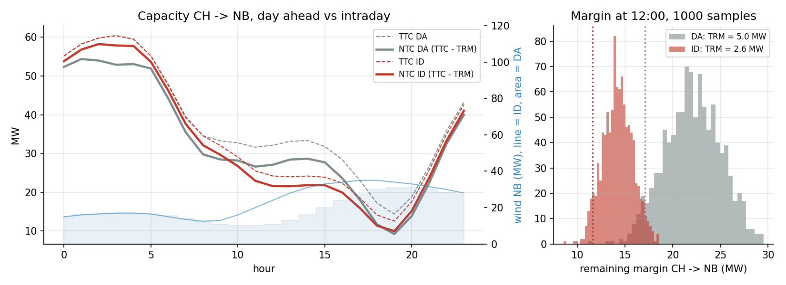
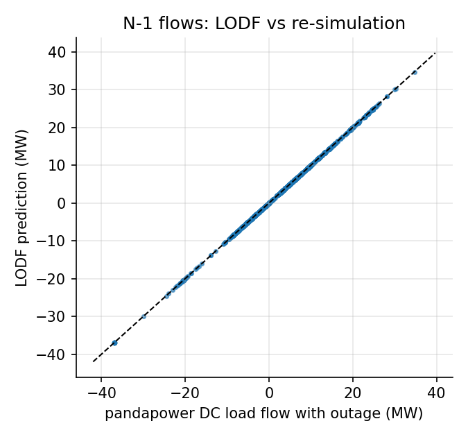
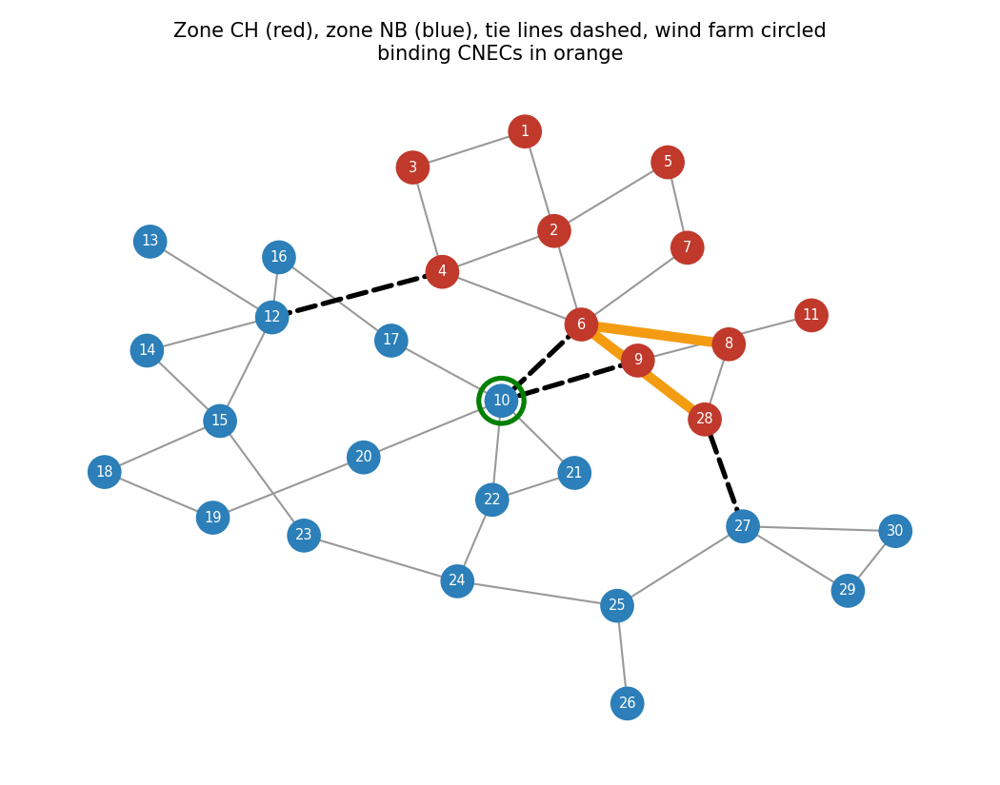

# Probabilistic intraday cross zonal capacity on the IEEE 30 bus grid

How much power can two bidding zones exchange without overloading any line, in the N state and after any single outage? How does that capacity change when the day ahead forecast is updated intraday, and how large a reliability margin does forecast uncertainty require?

This project answers those questions on the IEEE 30 bus test grid with the DC based method used for cross zonal capacity calculation in Europe, and checks every analytical result against full load flow simulations.



## Key results

| | Day ahead | Intraday |
|---|---|---|
| TTC CH to NB, daily average | 37.7 MW | 35.1 MW |
| TRM CH to NB (95 %, Monte Carlo) | 4.6 MW | 2.1 MW |
| NTC CH to NB | 33.1 MW | 33.0 MW |
| NTC NB to CH | 23.8 MW | 31.2 MW |

* **Every capacity value is backed by the N-1 analysis.** At the computed limit, re-simulating all 38 outages gives exactly 100 % loading on the binding element and no other overload; 1 MW more causes a violation.
* **Two CNEC/CO pairs limit the export all day:** line 6-8 after the outage of 6-28 and line 6-28 after the outage of 6-8 (they protect each other).
* **The intraday update works in both directions.** Higher wind in NB reduces TTC CH to NB by 2.7 MW on average, but the more accurate forecast cuts the TRM by 2.5 MW, so export capacity is almost unchanged. In the opposite direction both effects add up: +7.5 MW of NB to CH capacity on average.
* **DC is slightly optimistic.** A full AC N-1 analysis at 12:00 gives 31.2 MW instead of 32.1 MW, and the binding element changes because reactive flow adds to the current.

## Method

**1. DC sensitivities.** The nodal PTDF matrix gives the flow change on line *l* for 1 MW injected at bus *n* and withdrawn at the slack. The LODF gives the share of the pre outage flow of line *k* that moves to line *l* when *k* trips:

$$\text{LODF}_{l,k} = \frac{\text{PTDF}_{l,k}}{1 - \text{PTDF}_{k,k}}, \qquad F_l^{(k)} = F_l + \text{LODF}_{l,k}\,F_k$$

where $\text{PTDF}_{l,k}$ is the sensitivity of line *l* to a transfer between the terminals of line *k*. Outages with $\text{PTDF}_{k,k} = 1$ island part of the grid and are excluded (3 radial lines).

**2. Zonal PTDF.** Generation shift keys (GSK, pro rata to dispatch) turn nodal sensitivities into the flow per MW of exchange: $z_l = \text{PTDF}_l \cdot \text{GSK}_{CH} - \text{PTDF}_l \cdot \text{GSK}_{NB}$. Check: the zonal PTDFs of the tie lines add up to exactly 1.

**3. Maximum exchange.** For each state *s* (N and every credible outage) and each element with $|z_l^{(s)}| \geq 5\%$ (CNEC selection):

$$\Delta E = \min_{l,\,s}\ \frac{\pm F_l^{\max} - F_l^{(s)}}{z_l^{(s)}}, \qquad z_l^{(k)} = z_l + \text{LODF}_{l,k}\,z_k$$

$$\text{TTC} = \text{BCE} + \Delta E, \qquad \text{NTC} = \text{TTC} - \text{TRM}$$

where BCE is the exchange already in the base case.

**4. Probabilistic TRM.** Wind and load forecast errors (Gaussian, smaller intraday) are balanced by frequency containment reserves shared by both zones, so they create unscheduled flows. For each hour, 1 000 Monte Carlo samples give the distribution of the remaining margin; the TRM is the reduction not exceeded with 95 % probability.

## Validation

| Check | Result |
|---|---|
| PTDF flows vs pandapower DC load flow | max error 5e-14 MW |
| LODF flows vs 38 re-simulated outages (1 520 flows) | max error 1e-13 MW |
| Sum of tie line zonal PTDFs | 1.000000 |
| N-1 re-simulation at TTC | 100.00 % on binding element |
| N-1 re-simulation at TTC + 1 MW | 100.67 % (violation) |
| All 48 hourly base cases N-1 secure | yes |
| AC N-1 validated TTC at 12:00 | 31.2 MW vs 32.1 MW DC |

These checks run automatically in `tests/test_consistency.py`.





## Assumptions and limitations

* IEEE 30 bus case, zone 1 as CH and zones 2 and 3 as NB; original thermal ratings used as MW limits in DC; same rating in N and N-1 (no temporary emergency ratings).
* 50 MW wind farm at bus 10; illustrative daily profiles for load, wind and scheduled exchange; Gaussian, uncorrelated forecast errors.
* For the AC checks, loads are compensated to cos φ ≥ 0.95 and generators regulate 1.05 pu (in the original data line 6-8 is overloaded in AC even without exchange). DC results do not depend on this.
* No remedial actions (topology changes, phase shifting transformers, redispatch), which in practice increase capacity.
* NTC style bilateral calculation; flow based market coupling would use the same PTDF, LODF and CNEC building blocks.

## Run it

```bash
pip install -r requirements.txt
pytest -q                                   # consistency checks
jupyter notebook notebooks/capacity_analysis.ipynb
```

## Structure

```
src/capacity.py        DC sensitivities, contingencies, zonal PTDF, capacity calculation
src/scenarios.py       day ahead and intraday profiles, Monte Carlo TRM
notebooks/             full analysis, step by step, with outputs
tests/                 consistency tests against pandapower load flows
figures/               figures used in this README
```

Author: José Javier Cámara Manresa, [LinkedIn](https://linkedin.com/in/josejaviercamaramanresa)
